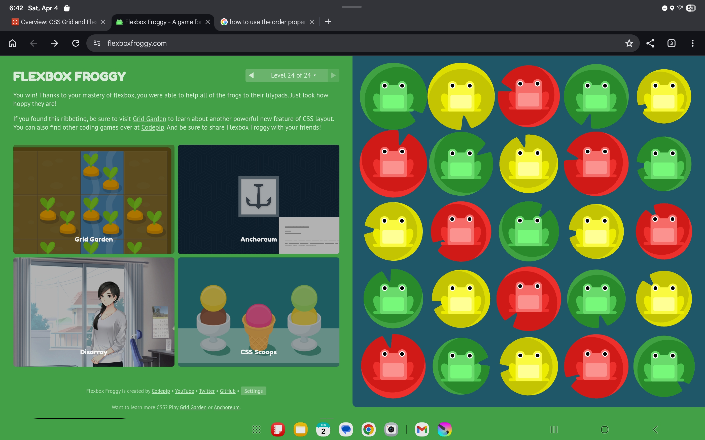
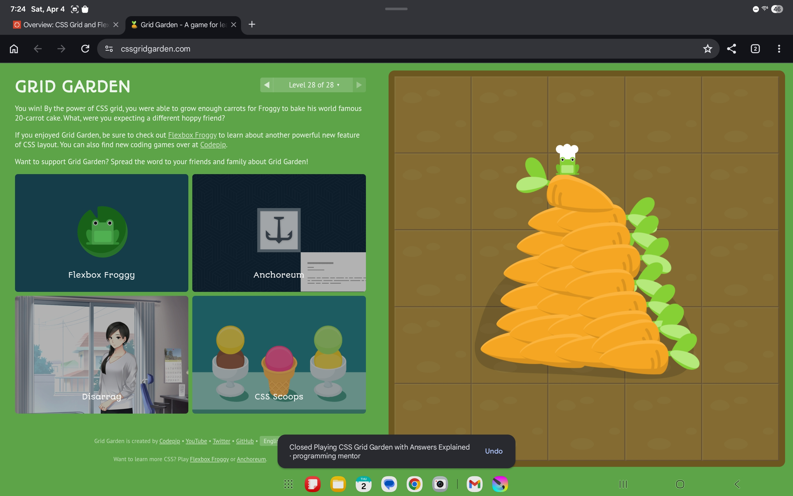

This week went farily well for me. The games cleared up a lot of confusion with flexbox specifically, though some of the grid elements still take some getting used to. As far as how I'm doing in general, I have been fairly busy with class, work, and clubs, but in the coming weeks things should slow down a bit. Still enjoying the class!

I like the efficiency that flexbox provides, and I didn't realize how often it is used in official sites. I feel like grid is less common, but both are making a lot more sense to me and I see the uses in different elements.
